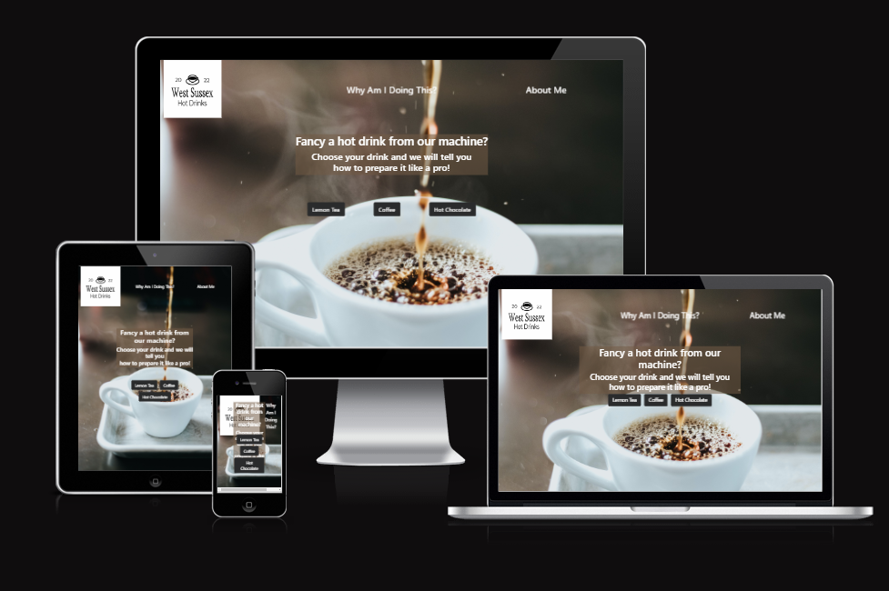

<h1 align="center"><strong>West Sussex Hot Drinks</strong></h1>

<h2>Technical Assessment - Red River</h2>

[View the live project here](https://josecastanocoding.github.io/west-sussex-hot-drinks/)

West Sussex Hot Drinks is a website aimed to to model the operation of a hot drinks machine. Based on the selection of a customer, the application will be required to make a drink according to a recipe for each choice.   

Based on the selection by the customer the application needs only to provide a readout on the actions performed during the preparation of the drink.

Thank you,
Jose 
07449 482 437
j.albertocast@gmail.com
